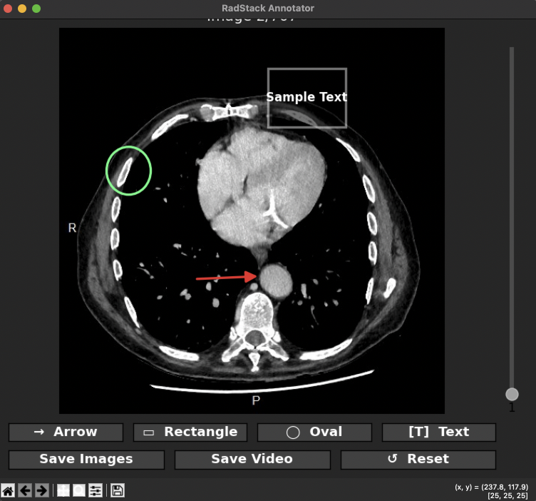
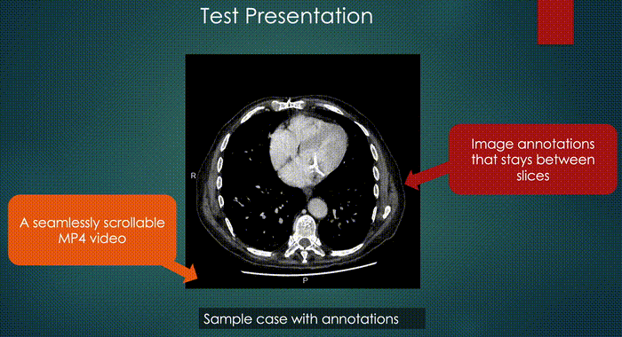

<p align="center">
  
</p>

# RadStack Annotator

A matplotlib-based GUI to browse, annotate, and export stacks of radiology
images slice by slice. Supports arrow, rectangle, oval, and text annotations
with an interpolation "stamp" feature.

The goal is to produce an MP4 video of the annotated stack that can be
embedded in PowerPoint, giving viewers near-scrollable dynamic images with
visible annotations — something no current tool offers for radiology
presentations.


<p align="center">
  
</p>

---

## Features

- **Input format** — accepts `.jpg` / `.jpeg` images sorted alphabetically (name them `001.jpg`, `002.jpg`, … for correct order)
- **Auto brightness/contrast** — each image is scaled to its min/max pixel range
- **Annotation tools** — Arrow, Rectangle, Oval, and Text labels
- **Stamp & interpolate** — copy an annotation to another slice with automatic interpolation across intermediate slices
- **Export** — save annotated slices as a new image stack
- **Export video** — compile the annotated stack into an MP4 video optimised for smooth scrubbing in PowerPoint (keyframe every frame)


---

## Project structure

```
radstack-annotator/
├── run.py              # Entry point — handles CLI args, launches viewer
├── settings.json       # Configurable constants (colours, layout)
├── pyproject.toml      # Project metadata & dependencies
├── LICENSE             # MIT license
├── .gitignore
├── screenshots/        # Screenshots for the README
└── src/
    ├── __init__.py     # Makes src/ a Python package
    ├── annotations.py  # Annotation data model and PIL rendering
    ├── loader.py       # load_images() — discovers and reads image files
    ├── saver.py        # Save/export logic for annotated stacks
    └── viewer.py       # ImageStackViewer class — UI layout & interaction
```

---

## Installation

### 1. Clone or download the repository

```bash
git clone https://github.com/yourusername/radstack-annotator.git
cd radstack-annotator
```

### 2. Install dependencies

Using **pip** (recommended):

```bash
pip install .
```

Or install manually:

```bash
pip install numpy matplotlib Pillow
```

> **Note:** The GUI requires a working display (it uses `TkAgg` under the
> hood). On macOS, Tkinter usually comes with Python. On Linux,
> install `python3-tk` via your package manager.
>
> **Video export** requires `ffmpeg` installed and available on your `PATH`.
> On macOS: `brew install ffmpeg`. On Linux: `sudo apt install ffmpeg`.
> On Windows: download from https://ffmpeg.org/.

---

## Usage

Place your JPG images in the `images/` folder (or a custom folder of your
choice). Files are loaded in alphabetical order, so name them
`001.jpg`, `002.jpg`, … to ensure correct slice ordering.

> **⚠️ Privacy warning:** Converting DICOM to JPG strips most metadata
> (name, ID, etc.), which is a first step toward anonymisation. However,
> it is your responsibility to ensure no text or other identifying
> information remains visible on the image pixels themselves.

```bash
python run.py                    # opens ./images/ folder (default)
python run.py /path/to/images    # opens a custom folder
```

### Controls

| Input | Action |
|---|---|
| Mouse wheel up/down | Previous / next image |
| Vertical slider | Drag to jump to an image |
| Tool buttons | Select annotation tool, then click-drag on image to draw |
| Scroll after selecting an annotation | Activates stamp mode |

---

## Configuration

Edit `settings.json` to adjust the look and feel:

| Key | Default | Description |
|---|---|---|
| `bg_color` | `"#2b2b2b"` | Background colour of the viewer window |
| `slider_x` | `0.94` | Horizontal position of the slice slider |
| `slider_w` | `0.02` | Width of the slider bar |
| `slider_scale` | `0.9` | Slider height relative to the image |
| `default_data_path` | `"./images"` | Default folder to open |

---

## Contributing

Contributions are welcome! Open an issue or submit a pull request.

---

## License

This project is open source and available under the
[MIT License](https://opensource.org/licenses/MIT).
